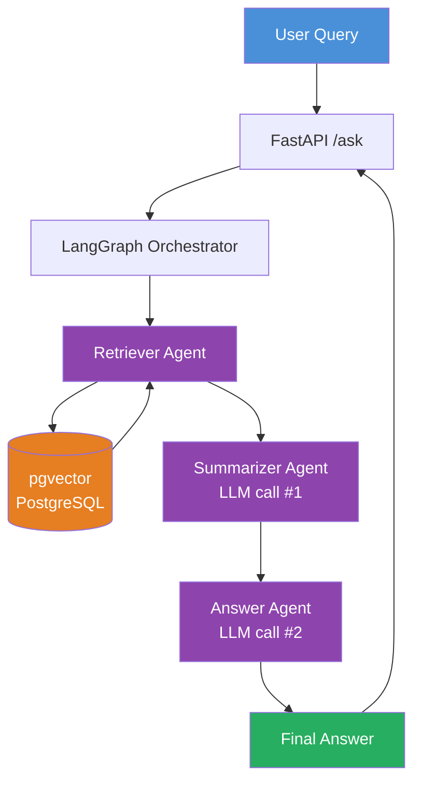

# Multi-Agent RAG System

A production-ready Retrieval-Augmented Generation system with a multi-agent architecture, built for technical document Q&A.

## Architecture



## Stack

| Component | Technology |
|---|---|
| Orchestration | LangGraph |
| Embeddings | Mistral API (mistral-embed, 1024 dims) |
| Vector DB | pgvector (PostgreSQL + ivfflat index) |
| LLM | Mistral (mistral-small-latest) |
| API | FastAPI |
| Evaluation | RAGAS |
| Infrastructure | Docker Compose |

## Why Multi-Agent?

Unlike a single-prompt RAG system, this architecture separates concerns into three specialized agents:

- **Retriever**: Pure semantic search — no LLM, fast and deterministic
- **Summarizer**: Condenses noisy retrieved chunks into clean context
- **Answer**: Generates faithful responses grounded strictly in context

This makes each step independently debuggable, replaceable, and extensible.

## Quick Start

**1. Clone and setup**

```bash
git clone https://github.com/YOUR_USERNAME/multi-agent-rag.git
cd multi-agent-rag
python3 -m venv .venv
source .venv/bin/activate
pip install -r requirements.txt
```

**2. Configure environment**

```bash
cp .env.example .env
# Add your MISTRAL_API_KEY
```

**3. Start pgvector**

```bash
docker compose up -d
```

**4. Ingest documents**

```bash
python -c "
from pipeline.ingestion import ingest_file
ingest_file('data/attention.pdf')
"
```

**5. Start the API**

```bash
uvicorn api.main:app --reload --port 8000
```

**6. Query**

```bash
curl -X POST http://localhost:8000/ask \
  -H "Content-Type: application/json" \
  -d '{"question": "What is the attention mechanism?"}'
```

## API Endpoints

| Method | Endpoint | Description |
|---|---|---|
| GET | `/health` | Health check |
| POST | `/ask` | Ask a question |
| POST | `/ingest` | Ingest a PDF |
| GET | `/docs` | Swagger UI |

## Evaluation

```bash
python evaluation/ragas_eval.py
```

Metrics:
- **Faithfulness**: Does the answer stay grounded in retrieved context?
- **Answer Relevancy**: Does the answer address the question?

## Use Case

Built for Q&A over ML research papers. Ingested papers:
- Attention Is All You Need (Vaswani et al., 2017)

## Project Structure

```
multi-agent-rag/
├── agents/
│   ├── retriever_agent.py    # Semantic search, no LLM
│   ├── summarizer_agent.py   # Context condensation, LLM #1
│   └── answer_agent.py       # Answer generation, LLM #2
├── pipeline/
│   ├── embeddings.py         # Mistral embed API
│   ├── ingestion.py          # PDF loading, chunking, pgvector storage
│   └── graph.py              # LangGraph orchestration
├── api/
│   └── main.py               # FastAPI endpoints
├── evaluation/
│   └── ragas_eval.py         # RAGAS metrics
├── data/                     # PDF documents
├── docker-compose.yml        # pgvector container
└── requirements.txt
```

## Key Technical Decisions

**Why Mistral for embeddings?** French sovereign AI, no data leaves France — aligned with Lyha's infrastructure philosophy. 1024-dim vectors outperform smaller models on semantic similarity.

**Why pgvector over FAISS?** Metadata filtering with SQL (`WHERE source = 'paper.pdf'`), persistent storage, and production-grade reliability without a separate vector store service.

**Why ivfflat index?** O(√n) approximate nearest-neighbour search. For < 1M vectors, the accuracy/speed tradeoff is optimal. HNSW would give better recall at 2-3x memory cost.

**Why separate summarizer and answer agents?** Retrieved chunks are often noisy and redundant. Summarization before generation improves answer quality and reduces hallucination.
